# 游戏知识图谱 · 数据挖掘报告（统计机器学习）

> 自动生成于 `analysis/run_ml.py`，输入为 `data/graph.json`（107 款游戏 / 15 家工作室 / 44 个玩法类型）。

- 样本：107 款游戏（其中年度最佳 20 款）

- 方法：高频因子特征工程 → 聚类(可插拔算法+PCA) → 社区发现(Louvain 主方法 + Infomap/Walktrap 随机游走对照) → 时代热点统计 → 开发商风格相似性(图谱距离 + 随机游走嵌入 双视角) → 年度最佳(GOTY)特征分析 → GOTY 品味网络(个性化随机游走)

- 产物：`analysis/output/` 下的 CSV / JSON / 16 张 PNG

> **⚠️ 局限性声明（阅读前必读）**
> 本报告是**探索性描述分析**，旨在从这张精选图谱上**产生假设**，所有结论均未经外部验证 / 随机对照，请以「呈现」而非「发现」看待。主要边界条件：
> 1. **选择偏差**：107 款游戏 = 20 款 GOTY + 87 款“其他作品”，且这 87 款**全部来自同一批 15 家 GOTY 获奖工作室**。故“GOTY vs 其他”实为**同工作室获奖作 vs 其非获奖作**的配对比较，并非“获奖作 vs 全体游戏”；文中“其他作品”均不含非获奖工作室的作品。
> 2. **年份混杂**：others 含 1996 年等老游戏，GOTY 均年(2015.5) 与 others 均年(2011.6) 的差距部分由收录方式人为造成。
> 3. **评分重言式**：`player_rating` 由 GOTY 定义本身决定，其高区分度属预期而非独立证据；`studio_wins` 由 `is_goty` 派生（标签泄漏），已按配置决定是否纳入因子表。
> 4. **PPR“品味网络”为工作室声望代理**：亲和力与 GOTY 种子数相关 ρ=0.635、与作品数相关 ρ=0.46，排名≈工作室体量×种子数；图内无玩家节点，“品味/推荐”为修辞。
> 5. **方法同源性**：聚类 / 社区发现 / 工作室相似 / GOTY 类型 over-index 四类方法高度依赖“类型”这一信号；工作室相似双视角（图谱距离 vs 随机游走）距离排序 Spearman ρ=0.80，高度一致说明它们度量同一结构，新增独立洞察有限。
> 6. **稳定性弱**：聚类轮廓 0.160（<0.25）、社区数 14/15/11、热点每半段仅 10 款，均提示探索性而非确定结论。
> 详见 `批判性反思_知识图谱分析.md`。

## 一、高频因子（特征工程）

把每张游戏节点视为一个「资产」，从图谱派生宽因子表（`factors.csv`，63 列 = 57 个因子）。因子分四组：

1. **图拓扑因子**：在「游戏-游戏相似投影图」上的度 / PageRank / 介数 / 聚类系数——衡量该游戏在玩法关系网中的中心性与桥接作用。

2. **属性因子**：Metacritic 评分、年份、玩法类型数、设计维度（开放世界/合作/在线）。

3. **声誉因子**：工作室夺冠数、作品总数、工作室 PageRank。

4. **类型 one-hot**：每个玩法叶子类型一列。

> 说明：原数据没有日内 tick 级时间序列，年份是可用的最细时间粒度，故「高频」指**从图结构派生的细粒度截面因子**，而非高频时序。

> 评分缺失填补：median（共 14 个“其他作品”无 Metacritic 分已填补）。

> 特征选择提示：拓扑因子与类型 one-hot 对用户相似度信号存在重叠（冗余）；聚类默认先做 PCA 白化以缓解；studio_wins 由 is_goty 派生（标签泄漏），当前 已包含。

## 二、聚类（kmeans + PCA）

在标准化因子矩阵经 PCA 白化后上聚类。
以轮廓系数在 k=2..9 选优，最优 **k=9**（轮廓=0.160）。
> 注：轮廓系数 0.160 偏低（<0.25），说明游戏在因子空间中呈连续谱，k 仅为探索性划分，并非严谨类别边界。
各簇画像：

| 簇 | 规模 | 年度最佳 | GOTY率 | 均分 | 代表游戏(前5) | 主导玩法类型 |
|---|---|---|---|---|---|---|
| 簇0 | 2 | 1 | 0.50 | 95.5 | 超级马里奥：奥德赛、宇宙机器人 | 3D平台跳跃(1.00)、CRPG(0.00)、未来竞速(0.00)、机甲动作(0.00)、模拟(0.00) |
| 簇1 | 7 | 1 | 0.14 | 74.7 | 守望先锋、魔兽世界、喷射战士2、守望先锋2、我的世界：故事模式 | 大型多人在线角色扮演(0.29)、英雄射击(0.29)、第三人称射击(0.14)、合家欢冒险(0.14)、动作角色扮演(0.14) |
| 簇2 | 48 | 3 | 0.06 | 86.5 | 战神（2018）、质量效应2、战神：诸神黄昏、战神2、星球大战：旧共和国武士 | 角色扮演(0.19)、动作角色扮演(0.19)、动作冒险(0.10)、冒险(0.08)、互动电影冒险(0.06) |
| 簇3 | 16 | 6 | 0.38 | 91.1 | 塞尔达传说：旷野之息、艾尔登法环、塞尔达传说：王国之泪、最后生还者、上古卷轴IV：湮没 | 动作冒险(0.94)、动作角色扮演(0.69)、生存恐怖(0.12)、第一人称射击(0.06)、3D平台跳跃(0.00) |
| 簇4 | 16 | 5 | 0.31 | 91.2 | 侠盗猎车手IV、侠盗猎车手V、侠盗猎车手III、荒野大镖客：救赎2、神秘海域2：纵横四海 | 动作冒险(0.81)、西部动作冒险(0.12)、侦探冒险(0.06)、太空角色扮演(0.06)、第三人称射击(0.06) |
| 簇5 | 5 | 1 | 0.20 | 89.6 | 光与影：33号远征队、自由力量、自由力量：对抗第三帝国、神界：龙指挥官、神界：陨落英雄 | 策略角色扮演(0.80)、回合制角色扮演(0.20)、3D平台跳跃(0.00)、竞速(0.00)、机甲动作(0.00) |
| 簇6 | 2 | 1 | 0.50 | 89.5 | 双影奇境、双人成行 | 合作冒险(1.00)、3D平台跳跃(0.00)、数字卡牌(0.00)、机甲动作(0.00)、模拟(0.00) |
| 簇7 | 8 | 1 | 0.12 | 88.6 | 生化奇兵、生化奇兵：无限、超级马里奥兄弟：惊奇、宇宙机器人：搜救行动、密特罗德：生存恐惧 | 第一人称射击(0.38)、银河恶魔城(0.12)、VR平台跳跃(0.12)、解谜冒险(0.12)、机甲动作(0.12) |
| 簇8 | 3 | 1 | 0.33 | 92.0 | 博德之门3、神界：原罪2、神界：原罪 | CRPG(1.00)、3D平台跳跃(0.00)、未来竞速(0.00)、机甲动作(0.00)、模拟(0.00) |

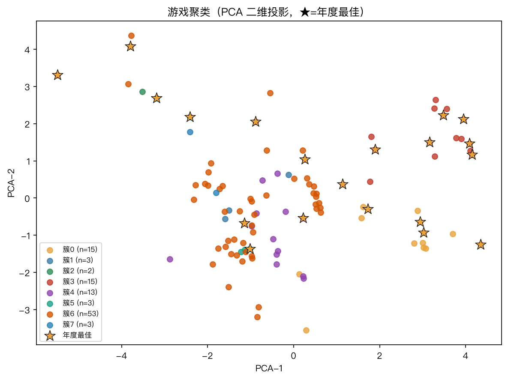

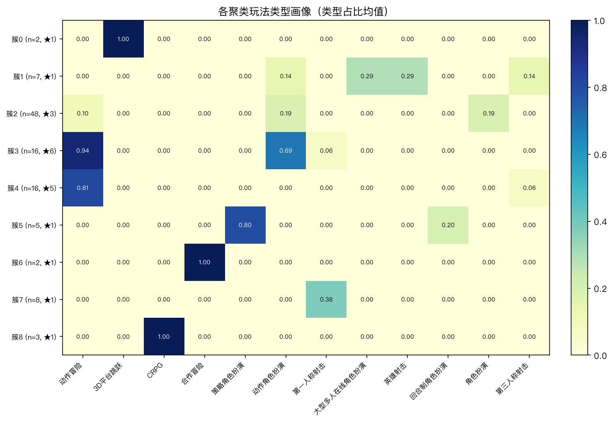

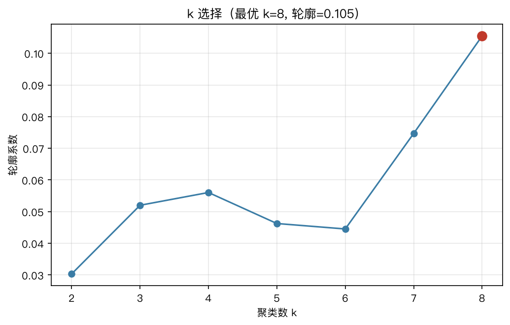

## 三、社区发现（Louvain）

在游戏-游戏相似投影图上做 louvain 划分，得到 **14 个社区**，**模块度 Q=0.6175**（越接近 1 划分越清晰）。社区即「玩法家族」：

| 社区 | 规模 | 年度最佳成员 | 代表游戏 | 主导玩法类型 |
|---|---|---|---|---|
| C0 | 17 | 战神（2018）、荒野大镖客：救赎、侠盗猎车手V、侠盗猎车手IV | 侠盗猎车手IV | 动作冒险(14)、西部动作冒险(2)、第三人称射击(1)、未来竞速(1)、侦探冒险(1) |
| C1 | 9 | 神秘海域2：纵横四海、最后生还者 第二部 | 神秘海域2：纵横四海 | 动作冒险(5)、平台跳跃(2)、生存恐怖(2)、卡丁车竞速(1)、平台动作(1) |
| C2 | 9 | 龙腾世纪：审判 | 质量效应2 | 角色扮演(5)、科幻角色扮演(3)、动作角色扮演(1) |
| C3 | 9 | 行尸走肉（第一季） | 行尸走肉（第一季） | 冒险(4)、互动电影冒险(3)、合家欢冒险(1)、喜剧冒险(1) |
| C4 | 8 | 上古卷轴V：天际、上古卷轴IV：湮没 | 上古卷轴V：天际 | 动作角色扮演(4)、动作冒险(4)、大型多人在线角色扮演(1)、太空角色扮演(1)、角色扮演(1) |
| C5 | 8 | 守望先锋 | 魔兽世界 | 动作角色扮演(3)、英雄射击(2)、即时战略(1)、大型多人在线角色扮演(1)、动作冒险(1) |
| C6 | 8 | 博德之门3 | 博德之门3 | 动作角色扮演(3)、CRPG(3)、策略角色扮演(2)、动作冒险(1) |
| C7 | 8 | 只狼：影逝二度、艾尔登法环 | 艾尔登法环 | 动作角色扮演(6)、动作冒险(2)、机甲动作(1) |
| C8 | 7 | 生化奇兵 | 生化奇兵 | 第一人称射击(4)、策略角色扮演(2)、战术射击(1)、动作角色扮演(1) |
| C9 | 7 | 巫师3：狂猎 | 巫师3：狂猎 | 动作角色扮演(3)、动作冒险(3)、角色扮演(3)、数字卡牌(2) |
| C10 | 7 | 塞尔达传说：旷野之息 | 塞尔达传说：旷野之息 | 动作冒险(2)、生活模拟(1)、银河恶魔城(1)、3D平台跳跃(1)、第三人称射击(1) |
| C11 | 5 | 宇宙机器人 | 宇宙机器人 | 3D平台跳跃(1)、增强现实(1)、平台跳跃(1)、VR平台跳跃(1)、虚拟现实(1) |
| C12 | 4 | 双人成行 | 双影奇境 | 合作冒险(2)、解谜冒险(1)、动作冒险(1) |
| C13 | 1 | 光与影：33号远征队 | 光与影：33号远征队 | 回合制角色扮演(1) |

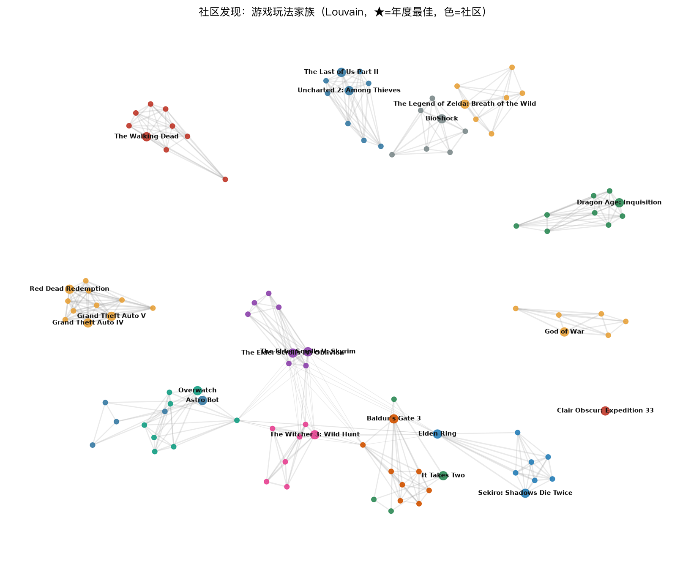

**Infomap 社区（玩法家族，按规模）：**

| 社区 | 规模 | 年度最佳成员 | 代表游戏 | 主导玩法类型 |
|---|---|---|---|---|
| C0 | 11 | 侠盗猎车手V、荒野大镖客：救赎、侠盗猎车手IV | 侠盗猎车手IV | 动作冒险(9)、西部动作冒险(2)、第三人称射击(1)、侦探冒险(1) |
| C1 | 9 | 神秘海域2：纵横四海、最后生还者 第二部 | 神秘海域2：纵横四海 | 动作冒险(5)、平台跳跃(2)、生存恐怖(2)、卡丁车竞速(1)、平台动作(1) |
| C2 | 9 | 龙腾世纪：审判 | 质量效应2 | 角色扮演(5)、科幻角色扮演(3)、动作角色扮演(1) |
| C3 | 9 | 行尸走肉（第一季） | 行尸走肉（第一季） | 冒险(4)、互动电影冒险(3)、合家欢冒险(1)、喜剧冒险(1) |
| C4 | 8 | 上古卷轴V：天际、上古卷轴IV：湮没 | 上古卷轴V：天际 | 动作角色扮演(4)、动作冒险(4)、大型多人在线角色扮演(1)、太空角色扮演(1)、角色扮演(1) |
| C5 | 8 | 博德之门3 | 博德之门3 | 动作角色扮演(3)、CRPG(3)、策略角色扮演(2)、动作冒险(1) |
| C6 | 8 | 只狼：影逝二度、艾尔登法环 | 艾尔登法环 | 动作角色扮演(6)、动作冒险(2)、机甲动作(1) |
| C7 | 8 | 守望先锋 | 魔兽世界 | 动作角色扮演(3)、英雄射击(2)、即时战略(1)、大型多人在线角色扮演(1)、动作冒险(1) |
| C8 | 7 | 生化奇兵 | 生化奇兵 | 第一人称射击(4)、策略角色扮演(2)、战术射击(1)、动作角色扮演(1) |
| C9 | 7 | 巫师3：狂猎 | 巫师3：狂猎 | 动作角色扮演(3)、动作冒险(3)、角色扮演(3)、数字卡牌(2) |
| C10 | 7 | 塞尔达传说：旷野之息 | 塞尔达传说：旷野之息 | 动作冒险(2)、生活模拟(1)、横向卷轴平台(1)、银河恶魔城(1)、3D平台跳跃(1) |
| C11 | 6 | 战神（2018） | 战神（2018） | 动作冒险(5)、未来竞速(1) |
| C12 | 5 | 宇宙机器人 | 宇宙机器人 | VR平台跳跃(1)、3D平台跳跃(1)、增强现实(1)、平台跳跃(1)、虚拟现实(1) |
| C13 | 4 | 双人成行 | 双影奇境 | 合作冒险(2)、解谜冒险(1)、动作冒险(1) |
| C14 | 1 | 光与影：33号远征队 | 光与影：33号远征队 | 回合制角色扮演(1) |

**Walktrap 社区（玩法家族，按规模）：**

| 社区 | 规模 | 年度最佳成员 | 代表游戏 | 主导玩法类型 |
|---|---|---|---|---|
| C0 | 23 | 上古卷轴IV：湮没、上古卷轴V：天际、巫师3：狂猎、只狼：影逝二度、艾尔登法环 | 艾尔登法环 | 动作角色扮演(13)、动作冒险(9)、角色扮演(4)、数字卡牌(2)、大型多人在线角色扮演(1) |
| C1 | 21 | 侠盗猎车手IV、侠盗猎车手V、荒野大镖客：救赎、战神（2018）、光与影：33号远征队、塞尔达传说：旷野之息 | 侠盗猎车手IV | 动作冒险(17)、西部动作冒险(2)、回合制角色扮演(1)、侦探冒险(1)、第三人称射击(1) |
| C2 | 9 | 神秘海域2：纵横四海、最后生还者 第二部 | 神秘海域2：纵横四海 | 动作冒险(5)、生存恐怖(2)、平台跳跃(2)、卡丁车竞速(1)、平台动作(1) |
| C3 | 9 | 龙腾世纪：审判 | 质量效应2 | 角色扮演(5)、科幻角色扮演(3)、动作角色扮演(1) |
| C4 | 9 | 行尸走肉（第一季） | 行尸走肉（第一季） | 冒险(4)、互动电影冒险(3)、喜剧冒险(1)、合家欢冒险(1) |
| C5 | 8 | 博德之门3 | 博德之门3 | 动作角色扮演(3)、CRPG(3)、策略角色扮演(2)、动作冒险(1) |
| C6 | 8 | 守望先锋 | 魔兽世界 | 动作角色扮演(3)、英雄射击(2)、即时战略(1)、大型多人在线角色扮演(1)、数字卡牌(1) |
| C7 | 7 | 生化奇兵 | 生化奇兵 | 第一人称射击(4)、策略角色扮演(2)、动作角色扮演(1)、战术射击(1) |
| C8 | 5 | 宇宙机器人 | 宇宙机器人 | 增强现实(1)、虚拟现实(1)、VR平台跳跃(1)、平台跳跃(1)、3D平台跳跃(1) |
| C9 | 5 | — | 超级马里奥：奥德赛 | 第三人称射击(1)、横向卷轴平台(1)、银河恶魔城(1)、3D平台跳跃(1)、生活模拟(1) |
| C10 | 3 | 双人成行 | 双影奇境 | 合作冒险(2)、解谜冒险(1) |

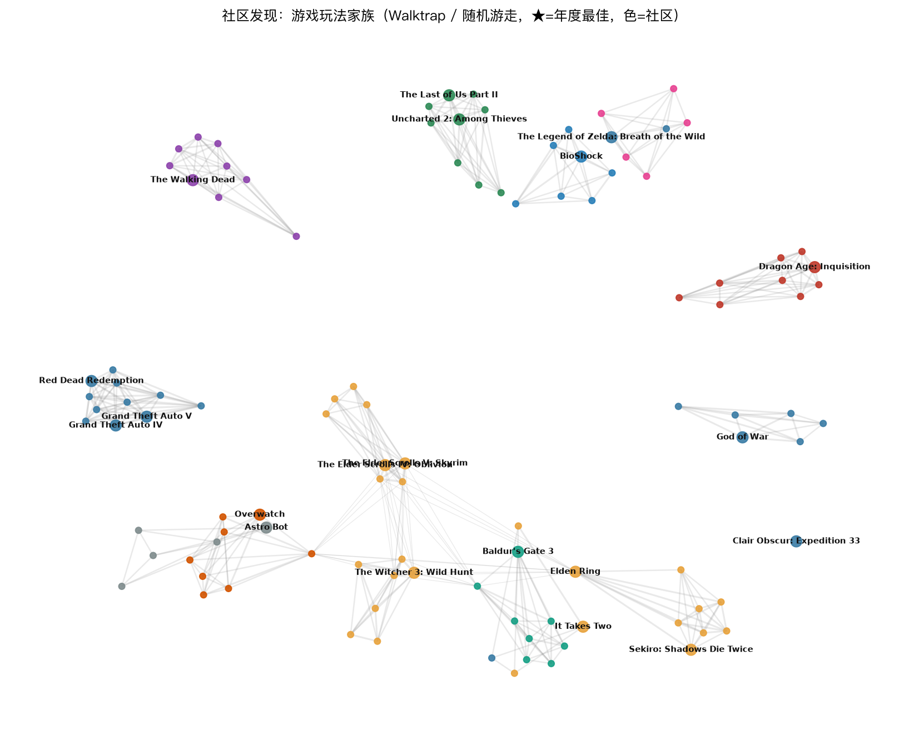

**主方法与随机游走方法（Infomap / Walktrap）对照：**

| 方法 | 社区数 | 模块度 Q | 编码长度 L |
|---|---|---|---|
| Louvain | 14 | 0.6175 | — |
| infomap | 15 | 0.6173 | 4.8924 |
| walktrap | 11 | 0.5905 | — |

> **Infomap** 基于**地图方程（Map Equation）**：图上模拟随机游走，求让信息流最短平均编码的划分，质量指标为**编码长度 L**（越小越好），天然支持层级、无需 resolution 调参。**Walktrap** 同样基于随机游走：用「游走到平稳所需步数」定义节点距离再做层次聚并，按模块度 Q 取最优切分。三种独立方法社区数接近，说明「玩法家族」结构稳健。

## 四、热点统计：奖项的「品味」如何演变

> **方法（一句话）**：热点 = GOTY 获奖作本身的类型构成随时间的变化（每年 1 款、两半段各 **10** 款，样本固定、无「其他作品」分母偏差）。某类型「占比」= 该半段带此标签的获奖作 ÷ 10。比较 **2006–2015** 与 **2016–2025** 两个半段判断上升/下降。

> **样本提示**：每半段仅 10 款，结果为**示意性趋势**而非统计推断。

**设计维度趋势（跨玩法的特征标签）：**
- 🔼 **多人合作**：0/10 款 → 3/10 款（+30.0pp）
- 🔼 **在线**：0/10 款 → 1/10 款（+10.0pp）
- 🔽 **开放世界**：7/10 款 → 2/10 款（-50.0pp）

**玩法类别趋势（上升 / 下降 Top）：**
- 🔼 **冒险**：1/10 款 → 2/10 款（+10.0pp）
- 🔼 **平台跳跃**：0/10 款 → 1/10 款（+10.0pp）
- 🔽 **动作冒险**：7/10 款 → 5/10 款（-20.0pp）
- 🔽 **角色扮演**：4/10 款 → 3/10 款（-10.0pp）

**GOTY 主导工作室（夺冠次数）：**
| 工作室 | GOTY 次数 |
|---|---|
| Rockstar 游戏 | 3 |
| 贝塞斯达游戏工作室 | 2 |
| 顽皮狗 | 2 |
| FromSoftware（フロムソフトウェア） | 2 |
| 非理性游戏 | 1 |
| Telltale游戏 | 1 |
| BioWare | 1 |
| CD Projekt Red | 1 |

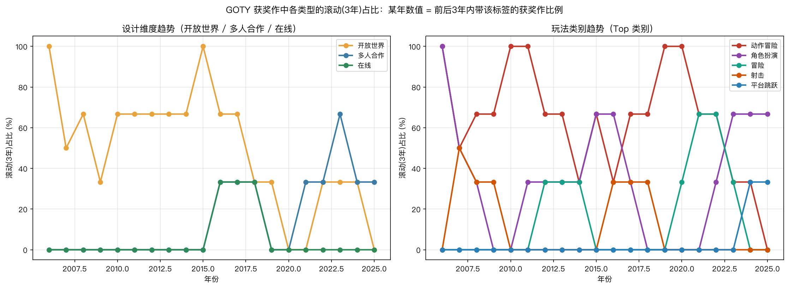

## 五、开发商游戏风格相似性（双视角：图谱距离 vs 随机游走嵌入）

本节用**两种互补的视角**度量工作室风格接近度，二者**并存、互为印证**，而非互相替代：

- **A. 图谱距离（最短路径）**：在游戏-游戏相似投影图 GG 上测工作室间最短路径距离，捕捉「直接共享类型 / 同工作室」的**一阶邻近性**（只数跳数）。

- **B. 随机游走嵌入**：在完整异构图做随机游走得到游戏嵌入、工作室取均值、余弦相似度，捕捉「经由共享类型 / 工作室间接相连」的**二阶 / 多跳邻近性**（多跳共现经 SVD 平滑降维）。

两者都基于同一张图；差异仅在于前者只数直接跳数、后者把多跳共现平滑后再比较。下面的相似度矩阵、Top 对与风格空间散点分别给出，最后给一致性对照。

共 **15 家**工作室，按**主导玩法家族社区**归并为 **14 组**：

| 主导玩法家族（社区） | 规模 | 成员工作室 |
|---|---|---|
| 动作冒险、西部动作冒险 | 2 | Rockstar 游戏、圣莫尼卡工作室 |
| 3D平台跳跃、增强现实 | 1 | Asobi团队 |
| 动作角色扮演、动作冒险 | 1 | 贝塞斯达游戏工作室 |
| 角色扮演、科幻角色扮演 | 1 | BioWare |
| 动作角色扮演、英雄射击 | 1 | 暴雪娱乐 |
| 动作角色扮演、动作冒险 | 1 | CD Projekt Red |
| 动作角色扮演、动作冒险 | 1 | FromSoftware（フロムソフトウェア） |
| 合作冒险、解谜冒险 | 1 | Hazelight工作室 |
| 第一人称射击、策略角色扮演 | 1 | 非理性游戏 |
| 动作角色扮演、CRPG | 1 | 拉瑞安工作室 |
| 动作冒险、平台跳跃 | 1 | 顽皮狗 |
| 动作冒险、生活模拟 | 1 | 任天堂企划制作本部（Nintendo Entertainment Planning & Development） |
| 回合制角色扮演 | 1 | 沙落互动 |
| 冒险、互动电影冒险 | 1 | Telltale游戏 |

### 5.1 图谱距离（最短路径）

边距离 = 1/(1+共享权重)，工作室距离 = 双向平均最近邻图距离，相似度 = 1/(1+距离)。这是「硬」的一阶信号，相似度集中在约 0.3~0.7 区间。

**最近的工作室对（Top8，相似度）：**

| 工作室 A | 工作室 B | 相似度 |
|---|---|---|
| Rockstar 游戏 | 圣莫尼卡工作室 | 0.460 |
| BioWare | CD Projekt Red | 0.447 |
| 贝塞斯达游戏工作室 | CD Projekt Red | 0.443 |
| 顽皮狗 | 圣莫尼卡工作室 | 0.434 |
| 贝塞斯达游戏工作室 | FromSoftware（フロムソフトウェア） | 0.432 |
| 顽皮狗 | Rockstar 游戏 | 0.432 |
| 任天堂企划制作本部（Nintendo Entertainment Planning & Development） | Rockstar 游戏 | 0.429 |
| 贝塞斯达游戏工作室 | 圣莫尼卡工作室 | 0.429 |

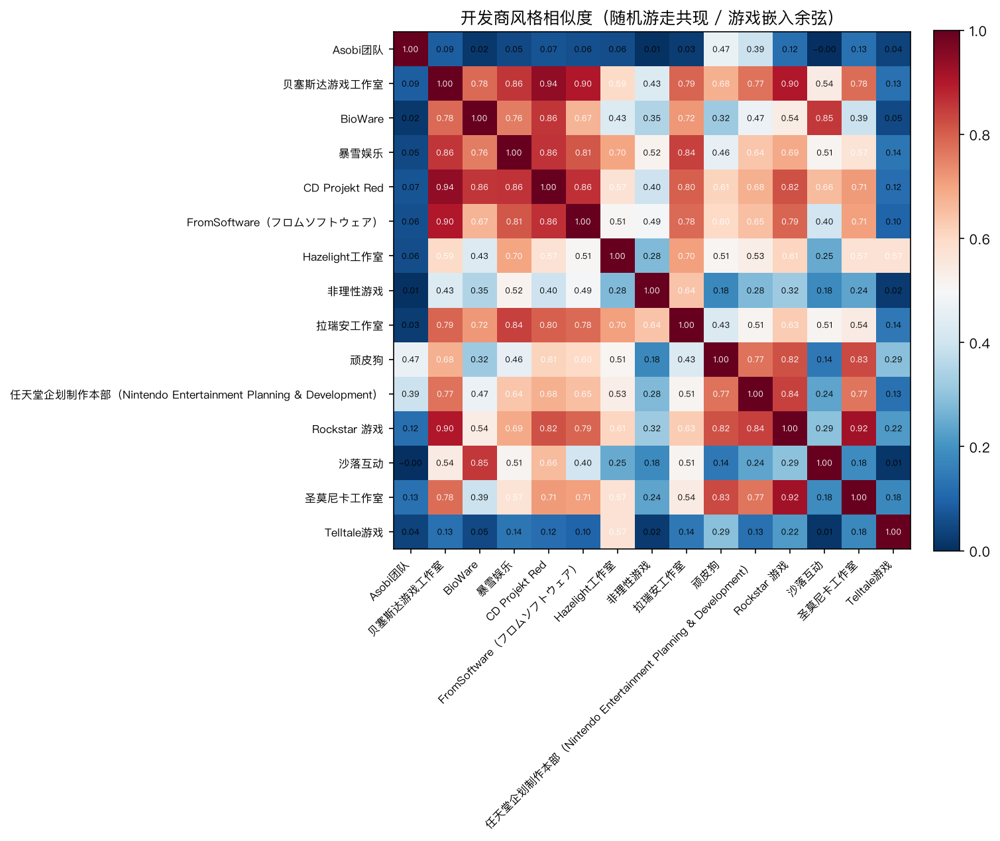

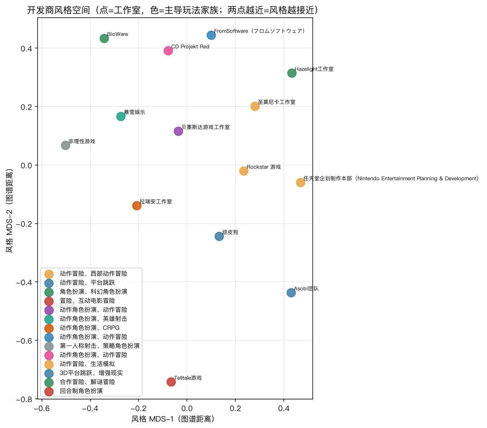

### 5.2 随机游走嵌入

在完整异构图跑截断随机游走 → 游戏共现矩阵(log1p) → SVD 降维得到游戏嵌入 → 工作室取均值 → 余弦相似度。这是「平滑」的二阶信号，相似度分离度更高（Top 对可达 0.9+）。

**最近的工作室对（Top8，余弦相似度）：**

| 工作室 A | 工作室 B | 余弦相似度 |
|---|---|---|
| 贝塞斯达游戏工作室 | CD Projekt Red | 0.944 |
| Rockstar 游戏 | 圣莫尼卡工作室 | 0.922 |
| 贝塞斯达游戏工作室 | Rockstar 游戏 | 0.900 |
| 贝塞斯达游戏工作室 | FromSoftware（フロムソフトウェア） | 0.899 |
| CD Projekt Red | FromSoftware（フロムソフトウェア） | 0.864 |
| 暴雪娱乐 | CD Projekt Red | 0.863 |
| 贝塞斯达游戏工作室 | 暴雪娱乐 | 0.856 |
| BioWare | CD Projekt Red | 0.856 |

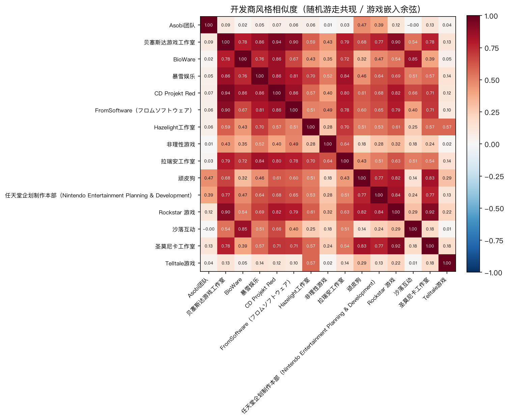

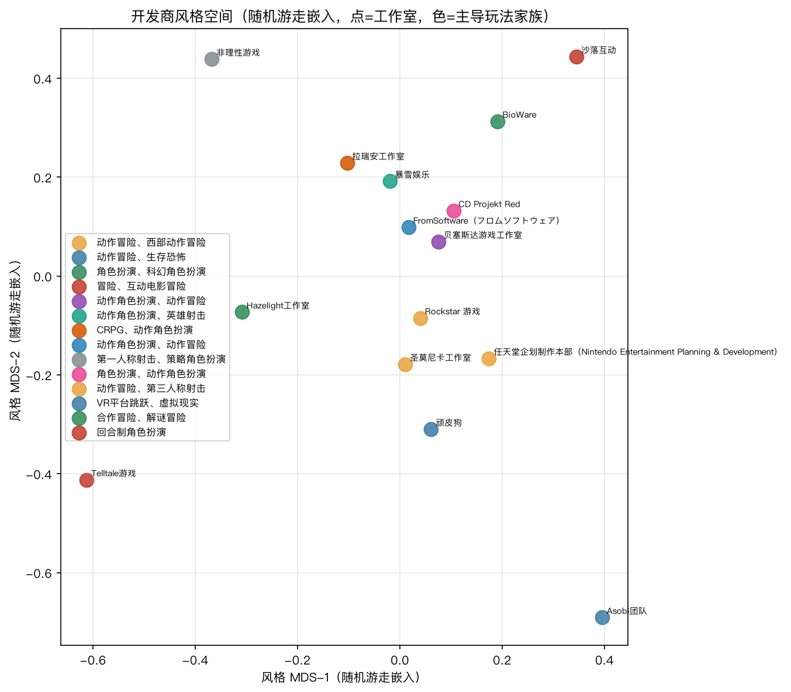

### 5.3 两种视角对照

- 两视角**距离排序的 Spearman 相关 ρ = 0.800**，说明两者高度一致——它们度量的是同一张图上的类型 / 工作室邻近性，只是表示方式不同。

- **共同点**：RPG / 动作 RPG 厂（贝塞斯达、CD Projekt Red、FromSoftware 等）在两种视角下都明显相近。

- **差异点**：随机游走因 SVD 平滑，相似度数值更分散、分离度更高；最短路径更「硬」（仅计跳数，数值压缩在较窄区间）。

> 诚实提示：两种视角度量的是**同一类信号（类型 / 工作室邻近性）的不同表示**，并非彼此独立的「新洞察」。随机游走是更平滑、更美观的等价尺子；把它当成「比最短路径更好」并不准确，正确定位是**与最短路径并列的探索手段**——两者一起看，比只看其中一个更稳妥。

## 六、年度最佳游戏（GOTY）特征分析

对比 **20 款** GOTY 与 **87 款** 其他作品：

- **媒体均分**：GOTY 93.7 vs 其他 86.5；**发行年均年**：2015.5 vs 2011.6

- **设计维度占比**：开放世界 0.45 vs 0.161；多人合作 0.15 vs 0.057；在线 0.05 vs 0.057

- **平均玩法类型数**：1.3 vs 1.11

**区分度最高的因子（Cohen's d，|d| 越大区分越强；正=GOTY 更高）：**

| 因子 | GOTY均值 | 其他均值 | Cohen's d |
|---|---|---|---|
| player_rating | 93.65 | 86.483 | 0.976 |
| has_open_world | 0.45 | 0.161 | 0.725 |
| gg_degree | 25.75 | 17.253 | 0.599 |
| n_genres | 1.3 | 1.115 | 0.525 |
| gg_pagerank | 0.01 | 0.009 | 0.507 |
| has_coop | 0.15 | 0.057 | 0.352 |
| gg_clustering | 0.791 | 0.847 | -0.321 |
| studio_pagerank | 0.011 | 0.012 | -0.223 |
| studio_n_games | 7.7 | 7.943 | -0.137 |
| gg_betweenness | 0.012 | 0.01 | 0.122 |
| has_online | 0.05 | 0.057 | -0.032 |

> 解读：Cohen's d 仅 0.2/0.5/0.8 为弱/中/强效应参考线；本数据样本小、GOTY 是精英子集，d 偏向刻画「获奖作相对全体的偏移」而非因果。

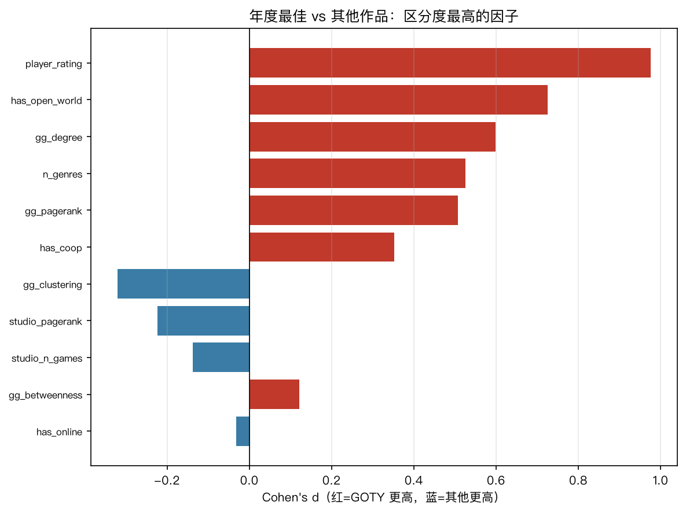

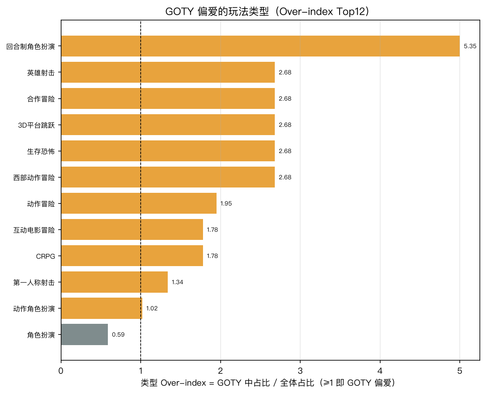

## 七、GOTY 品味网络（个性化随机游走）

把**全部年度最佳（GOTY）获奖作**作为种子，在完整异构图（游戏↔类型↔工作室↔奖项）上做**个性化 PageRank**（随机游走以一定概率回到 GOTY 种子）。某节点得分越高，代表它在「年度最佳品味」网络中越中心——等于回答“**喜欢 GOTY 的人，还会喜欢谁**”。

种子共 **20** 款；排除种子后，亲和力最高的非 GOTY 作品 Top10：

| 排名 | 游戏 | 工作室 | 亲和力 |
|---|---|---|---|
| 1 | 辐射3 | 贝塞斯达游戏工作室 | 0.0053 |
| 2 | 辐射4 | 贝塞斯达游戏工作室 | 0.0053 |
| 3 | 神界2：龙刃 | 拉瑞安工作室 | 0.0051 |
| 4 | 赛博朋克2077 | CD Projekt Red | 0.0050 |
| 5 | 赛博朋克2077：往日之影 | CD Projekt Red | 0.0050 |
| 6 | 暗黑破坏神IV | 暴雪娱乐 | 0.0049 |
| 7 | 侠盗猎车手III | Rockstar 游戏 | 0.0045 |
| 8 | 侠盗猎车手：罪恶都市 | Rockstar 游戏 | 0.0045 |
| 9 | 侠盗猎车手：圣安地列斯 | Rockstar 游戏 | 0.0045 |
| 10 | 恶霸鲁尼 | Rockstar 游戏 | 0.0045 |

**工作室亲和力 Top（其全部作品得分之和）：**

| 排名 | 工作室 | 亲和力 |
|---|---|---|
| 1 | Rockstar 游戏 | 0.0765 |
| 2 | 贝塞斯达游戏工作室 | 0.0517 |
| 3 | 顽皮狗 | 0.0461 |
| 4 | FromSoftware（フロムソフトウェア） | 0.0424 |
| 5 | CD Projekt Red | 0.0318 |
| 6 | 暴雪娱乐 | 0.0316 |
| 7 | 拉瑞安工作室 | 0.0312 |
| 8 | 任天堂企划制作本部（Nintendo Entertainment Planning & Development） | 0.0283 |
| 9 | 圣莫尼卡工作室 | 0.0274 |
| 10 | Telltale游戏 | 0.0270 |

> 解读：这是从「GOTY 视角」出发的推荐网络，天然浮现每家获奖作的「同门兄弟」（如 Bethesda 的辐射系列、CDPR 的赛博朋克、Rockstar 的 RDR/GTA）。它与第三节的社区发现、第五节的工作室风格同源于一张图，但视角从「结构划分」转为「以 GOTY 为中心的影响力传播」。

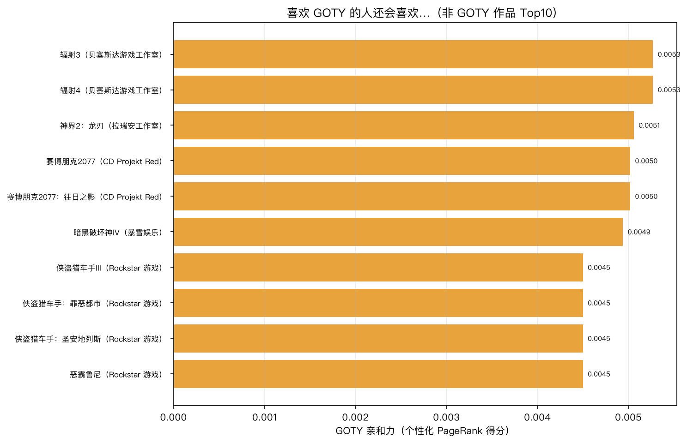

## 八、中心性排行 & 因子相关性

在玩法关系网中 PageRank 最高的游戏（枢纽/桥接型作品）：

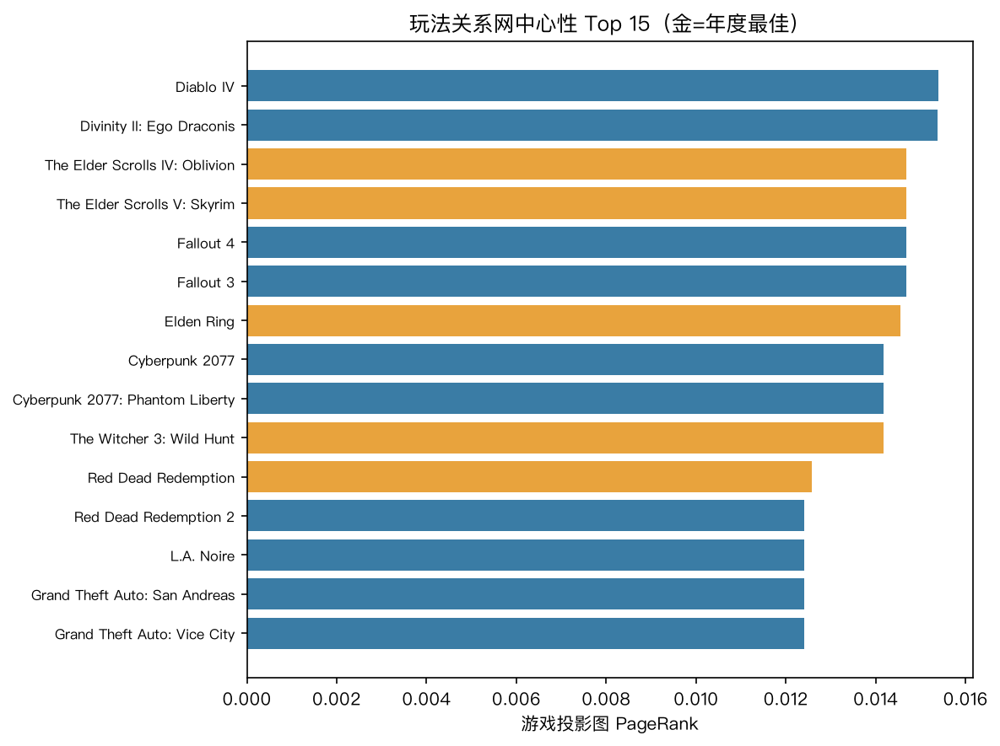

因子两两相关（识别多重共线，提示哪些因子信息重叠）：

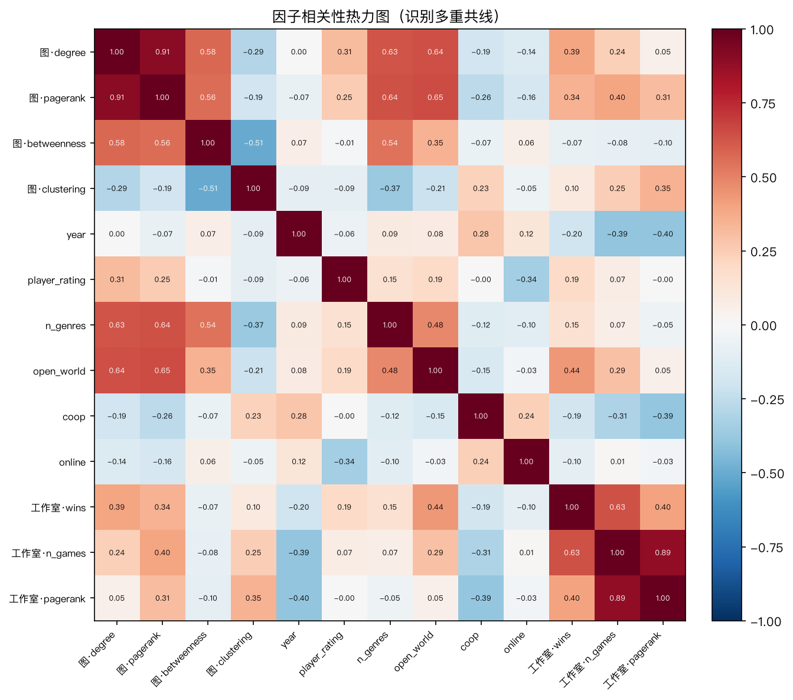
